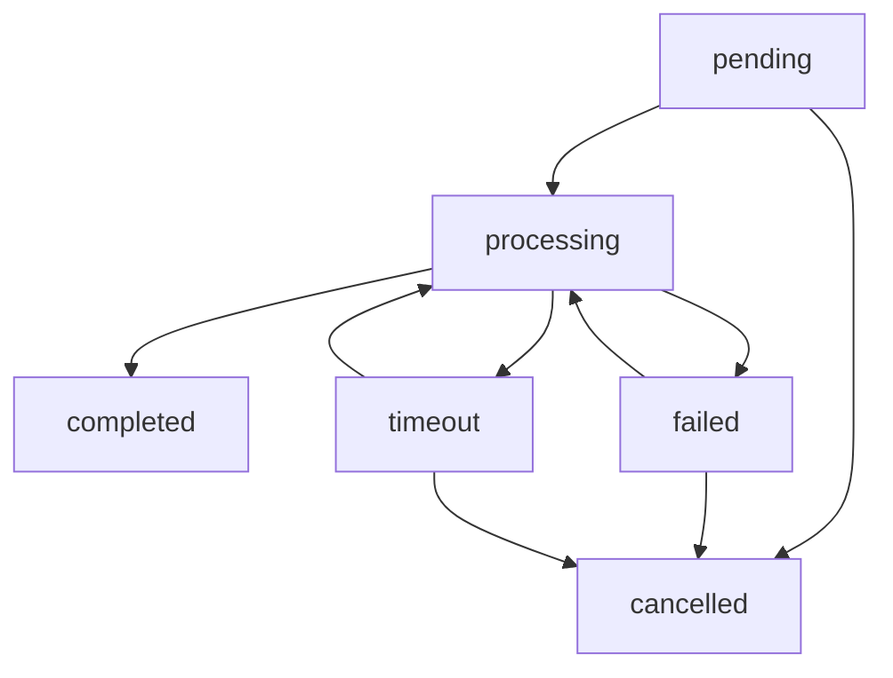

# 📊 任务数据库设计详细说明

## 🗃️ 集合结构：tasks

### 完整字段定义

```json
{
  "_id": "string (云数据库自动生成的任务ID)",
  "_openid": "string (用户openid，云开发自动注入)",
  "task_uuid": "string (自定义任务UUID，用于webhook识别)",
  "status": "string (任务状态枚举)",
  "coze_execute_id": "string (Coze API返回的执行ID)",
  "input_url": "string (用户输入的视频链接)",
  "result": {
    "title": "string (视频标题)",
    "content": "string (提取的文案内容)",
    "cover": "string (视频封面图片URL)",
    "video_url": "string (处理后的视频下载链接)"
  },
  "error_message": "string (错误信息，失败时记录)",
  "progress": "number (处理进度 0-100)",
  "retry_count": "number (重试次数，默认0)",
  "webhook_received": "boolean (是否已收到webhook回调)",
  "notification_sent": "boolean (是否已发送订阅消息)",
  "created_at": "Date (任务创建时间)",
  "updated_at": "Date (最后更新时间)",
  "started_at": "Date (开始处理时间)",
  "completed_at": "Date (完成时间)",
  "expires_at": "Date (任务过期时间，创建后24小时)"
}
```

### 状态枚举说明

| 状态 | 说明 | 用户可见 | 后续操作 |
|------|------|----------|----------|
| `pending` | 任务已创建，等待处理 | "正在排队..." | 调用Coze API |
| `processing` | 正在处理中 | "正在解析视频..." | 等待webhook |
| `completed` | 处理完成 | "解析完成！" | 显示结果 |
| `failed` | 处理失败 | "解析失败" | 允许重试 |
| `timeout` | 处理超时 | "解析超时" | 允许重试 |
| `cancelled` | 用户取消 | "已取消" | 无 |

### 索引建议

```javascript
// 建议创建的索引
{
  "_openid": 1,           // 用户查询任务
  "status": 1,            // 状态查询
  "task_uuid": 1,         // webhook查询 (唯一)
  "coze_execute_id": 1,   // Coze ID查询 (唯一)
  "created_at": -1,       // 时间排序
  "expires_at": 1         // 清理过期任务
}
```

## 🔄 状态流转图



## 📝 使用示例

### 创建任务
```javascript
const taskData = {
  task_uuid: generateUUID(),
  status: 'pending',
  coze_execute_id: executeId,
  input_url: userInputUrl,
  result: null,
  error_message: null,
  progress: 0,
  retry_count: 0,
  webhook_received: false,
  notification_sent: false,
  created_at: new Date(),
  updated_at: new Date(),
  expires_at: new Date(Date.now() + 24 * 60 * 60 * 1000) // 24小时后过期
};
```

### 更新任务状态
```javascript
await db.collection('tasks').doc(taskId).update({
  data: {
    status: 'completed',
    result: extractedData,
    completed_at: new Date(),
    updated_at: new Date()
  }
});
```

### 查询用户任务
```javascript
const userTasks = await db.collection('tasks')
  .where({
    _openid: userOpenid,
    status: _.in(['pending', 'processing'])
  })
  .orderBy('created_at', 'desc')
  .get();
```
