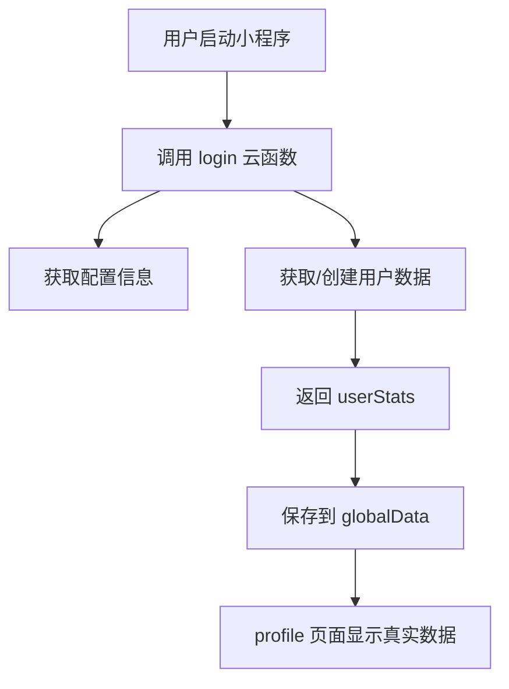

# 用户数据实时显示系统

## 🎯 功能概述

用户数据实时显示系统让 profile 页面能够显示真实的用户统计数据，包括提取次数、分享次数和积分，而不是硬编码的假数据。

## 🔧 技术实现

### 1. 数据获取流程



### 2. 核心文件修改

**云函数 `login/index.js`**
- ✅ 同时获取应用配置和用户统计数据
- ✅ 新用户自动创建记录，使用配置的初始积分
- ✅ 自动更新最后登录时间
- ✅ 容错处理，失败时返回默认值

**前端 `app.ts`**
- ✅ 添加 `userStats` 到 globalData
- ✅ 提供 `getUserStats()` 和 `updateUserStats()` 方法
- ✅ 登录时同时处理用户统计数据

**个人页面 `profile.ts`**
- ✅ 从 globalData 获取真实用户数据
- ✅ 页面显示时刷新数据
- ✅ 分享操作实时更新统计数据

## 📊 数据结构

### UserStats 接口
```typescript
interface UserStats {
  extractCount: number; // 提取次数
  shareCount: number;   // 分享次数
  points: number;       // 积分
  createdAt: Date;      // 创建时间
  lastLoginAt: Date;    // 最后登录时间
}
```

### 数据库 users 集合
```json
{
  "_id": "系统生成",
  "_openid": "用户唯一标识",
  "extract_count": 0,
  "share_count": 0,
  "points": 100,
  "created_at": "2024-01-20T00:00:00.000Z",
  "last_login_at": "2024-01-20T00:00:00.000Z"
}
```

## 🔄 数据同步机制

### 1. 初始化
- 用户首次启动时，login 云函数自动创建用户记录
- 使用配置项中的 `initialPoints` 作为初始积分

### 2. 实时更新
- **提取文案**: `index.ts` 中调用云函数更新数据库，同步更新本地 globalData
- **分享操作**: `profile.ts` 中立即更新本地 globalData，提升用户体验

### 3. 页面刷新
- 每次进入 profile 页面自动刷新显示数据
- 确保数据的一致性和实时性

## 📱 用户体验

### Before (硬编码数据)
- ❌ 显示固定的假数据 (1234, 56, 89)
- ❌ 无法反映用户真实使用情况
- ❌ 数据不会随用户操作变化

### After (真实数据)
- ✅ 显示用户真实的使用统计
- ✅ 操作后立即更新显示
- ✅ 新用户从 0 开始，老用户显示历史数据
- ✅ 积分使用配置项的初始值

## 🎮 用户操作效果

### 文案提取
1. 用户在首页成功提取文案
2. 云函数更新数据库 `extract_count + 1`
3. 本地 globalData 同步更新
4. profile 页面立即显示新的提取次数

### 分享操作
1. 用户在 profile 页面触发分享
2. 本地 globalData 立即更新 `shareCount + 1`
3. 页面实时显示新的分享次数
4. 用户体验流畅无延迟

## 🔧 配置集成

- **初始积分**: 使用 `app_config.initialPoints` 配置
- **积分奖励**: 可通过配置项调整各种操作的积分奖励
- **容错机制**: 配置获取失败时使用默认值 100 积分

## 📋 测试验证

### 新用户测试
1. 清除小程序数据或使用新微信号
2. 启动小程序，检查 profile 页面显示 0, 0, 100（初始积分）
3. 进行提取和分享操作，验证数据变化

### 老用户测试
1. 使用已有数据的用户
2. 验证显示真实的历史数据
3. 进行操作后验证数据正确更新

## 💡 技术优势

1. **性能优化**: 登录时一次获取所有数据，减少请求次数
2. **用户体验**: 操作后立即更新显示，无需等待网络请求
3. **数据一致**: 云函数和本地数据双重更新机制
4. **容错稳定**: 多层次的错误处理和默认值机制
5. **配置灵活**: 初始积分等参数可通过配置动态调整

现在用户在 profile 页面看到的就是他们真实的使用数据，增强了用户的参与感和成就感！
